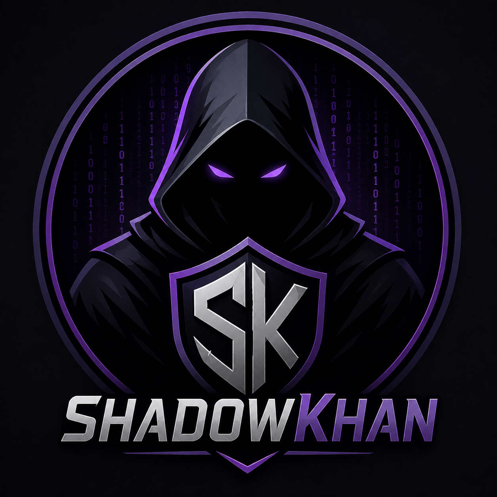

<div align="center">
  
  <h1>ShadowKhan 🥷</h1>
  <p><strong>Transform simple questions into perfectly structured academic prompts.</strong></p>
</div>

---

**ShadowKhan** is a premium, high-performance browser extension designed exclusively for students, researchers, and academics. It acts as an intelligent intermediary between your raw thoughts and academic discussion boards. By leveraging cutting-edge Large Language Models (LLMs), ShadowKhan transforms basic questions into powerful, structurally sound discussion prompts ready for deployment.

Featuring a sleek, dark-themed UI and a seamless workflow, ShadowKhan bypasses restrictive clipboard constraints found on many modern academic portals by directly injecting text into target elements via native property setters.

## ✨ Core Features

*   **Intelligent Prompt Forging:** Powered by **Nvidia Nemotron 3 Ultra 550B** (via OpenRouter), ShadowKhan rewrites and meticulously structures your raw questions into high-quality academic prompts based on strict instructional templates.
*   **Anti-Block Injection System:** Bypasses standard copy-paste restrictions (`Ctrl+V` blocks) by utilizing direct DOM manipulation and native property setters to seamlessly inject forged text into the target `textarea`.
*   **Floating Action Button (FAB):** Automatically injects a sleek, glowing FAB onto designated portals (e.g., `learner.saveetha.in`) for instant, one-click access to the forging engine.
*   **Dual-Mode Workflow:** 
    *   **Inject Raw:** Instantly inject your unedited text to bypass portal restrictions.
    *   **Forge & Inject:** Generate an enhanced prompt, review the output, and inject it with a single click.
*   **Premium Aesthetics:** Built with a stunning dark mode interface, glassmorphism elements, fluid micro-animations, and a responsive design system.

---

## 🚀 Installation (Developer Mode)

1. Clone or download this repository to your local machine:
   ```bash
   git clone https://github.com/karthi-s-13/shadowkhan.git
   ```
2. Open your browser and navigate to the Extensions page:
   *   **Chrome/Brave:** `chrome://extensions/`
   *   **Edge:** `edge://extensions/`
3. Enable **Developer mode** in the top right corner of the extensions page.
4. Click **Load unpacked** and select the `shadowkhan` directory you just cloned.

---

## ⚙️ Configuration (API Key Required)

To power the advanced prompt forging capabilities, ShadowKhan connects to the [OpenRouter API](https://openrouter.ai/). **You must provide your own API key to activate the AI features.**

1. Open `background.js` in your preferred text/code editor.
2. Locate the API Key configuration at line 9:
   ```javascript
   const API_KEY = 'YOUR_OPENROUTER_API_KEY_HERE';
   ```
3. Replace `'YOUR_OPENROUTER_API_KEY_HERE'` with your actual OpenRouter API key.
4. Save the file.
5. Go back to your browser's Extensions page and click the **Reload** button on the ShadowKhan extension tile to apply the changes.

> **⚠️ Security Warning:** Never commit your actual API key to version control. The repository includes a `.gitignore` to help prevent accidental commits, but always review your changes before pushing.

---

## 🛠️ Usage Guide

ShadowKhan can be accessed in two primary ways depending on your workflow:

### 1. Via the Extension Popup (Global Access)
*   Click the **ShadowKhan icon** in your browser toolbar to open the popup.
*   Type your raw question into the text area.
*   Click **Forge Prompt** to let the Nvidia Nemotron model process and enhance your text.
*   Click **Copy** to save it to your clipboard, or **Inject into Page** to attempt a direct injection into the active tab.
*   Alternatively, click **Inject Raw** to skip the AI processing and inject your exact text.

### 2. Via the Floating Icon (Targeted Portals)
*   Navigate to a supported portal (e.g., `https://learner.saveetha.in/`).
*   Locate the pulsing, purple **ShadowKhan icon** in the bottom right corner of the screen.
*   Click the icon to open the integrated overlay panel.
*   Enter your question and select either **Inject Raw** or **Forge Prompt**.
*   If forging, review the AI-enhanced output, then click **Inject Forged** to automatically fill the text area and trigger the necessary input events for the site's frontend framework.

---

## 🏗️ Architecture

*   **Manifest V3:** Built using the modern, secure Manifest V3 extension architecture.
*   **Service Worker (`background.js`):** Handles all asynchronous communication with the OpenRouter API, keeping API keys out of the content script environment.
*   **Content Script (`content.js` & `content.css`):** Manages the FAB injection, overlay UI, and advanced DOM manipulation for text injection.
*   **Popup (`popup.html`, `popup.css`, `popup.js`):** Provides a clean, standalone interface for prompt generation on any website.

---

## 📜 License

This project is licensed under the MIT License. See the `LICENSE` file for details.

<div align="center">
  <sub>Forged from the shadows.</sub>
</div>
